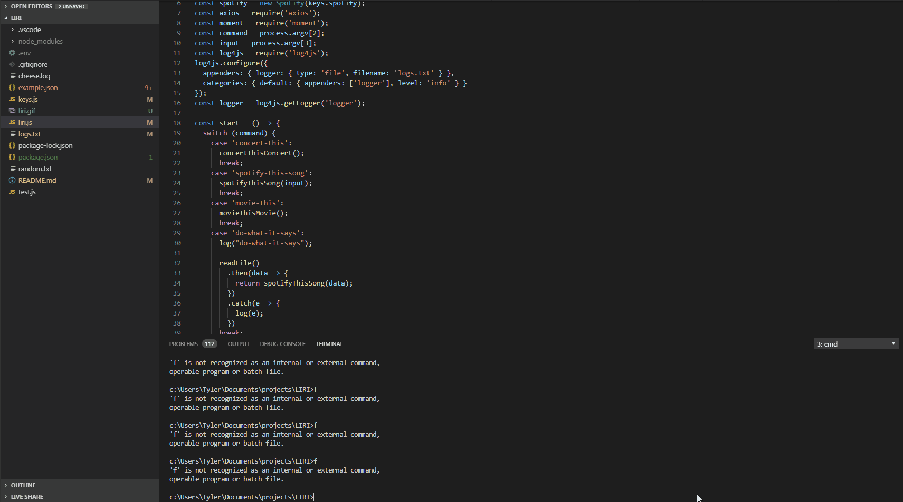

# LIRI
## everything console logged is also stored to logs.txt

## MULTIPLE WORD INPUTS SHOULD BE IN QUOTATIONS

## commands : concert-this , spotify-this-song, movie-this, and do-what-it-says
## Syntax :   command *input*

## concert-this : takes in band and shows 10 concerts ordered by date
### Snytax : concert-this *band*

## spotify-this-song : takes in a song and lists information about it
### Snytax : spotify-this-song *song*

## movie-this : takes in a movie and lists information about it
### movie-this *movie*

## do-what-it-says : takes the input from random.txt and then preforms spotify-this-song on it
### do-what-it-says      (and change logs.txt file if you want to change it)

# Shown in action here : https://i.imgur.com/ODKMR77.gifv

# also liri.gif in this directory.